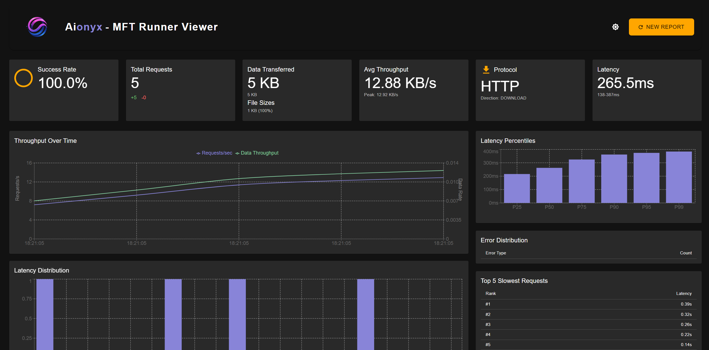
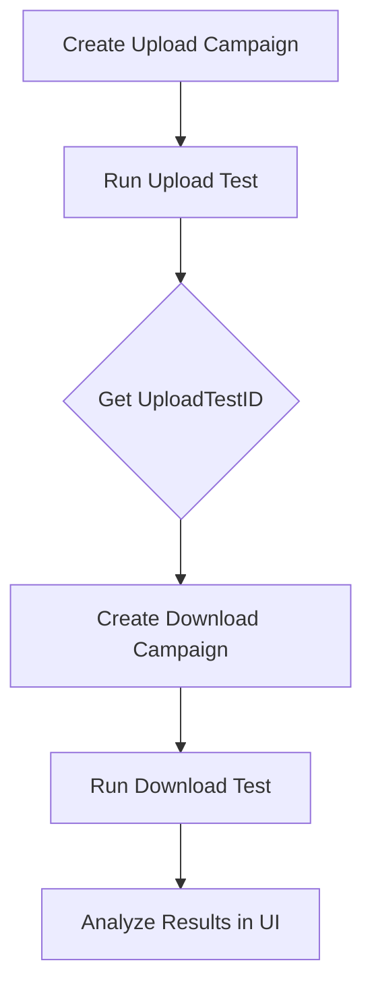

# 🚀 MFT Runner - Enterprise File Transfer Benchmarking Suite


A high-performance testing framework for evaluating file transfer protocols under various network conditions and load scenarios.



## 🌟 Key Features

- **Multi-Protocol Testing**: FTP, SFTP, HTTP support
- **Visual Analytics**: Illustrated dashboard after test execution
- **Campaign System**: Save and reuse test configurations
- **Smart Load Generation**:
  - Custom file size distributions
  - Concurrent client simulations
  - Automated cleanup
- **Historical Comparison**: Track performance changes over time

## 🛠 Getting Started

### Prerequisites

- Go 1.21+ [only for building the .exe if needed]
- Node.js 18+ (for web interface) [frontend directory]
- Test server running (FTP/SFTP/HTTP) [one is provided in the repo: testserver.py]

```bash
# Clone & Build
git clone https://github.com/FulcrumIndustries/MFT_Runner.git

# [Optional] Build the load testing tool (requires Go)
cd MFT_Runner
go build -o mft-runner.exe cmd/runner/main.go

# Start the web interface (requires Node.js)
cd frontend
npm install

# Start the web interface in DEV mode
npm run dev

# Start the web interface in PROD mode
npm run build
npm run start
```

## 🧪 Basic Workflow

### 1. Run Upload Test

```bash
./mft-runner Campaigns/UPLOAD_FTP_1KB.json 10 100
```

- `10` concurrent clients
- `100` total files
- Outputs `UploadTestID` for download tests

### 2. Run Download Test

- Set the `UploadTestID` in the download campaign file

```bash
./mft-runner Campaigns/DOWNLOAD_FTP_1KB.json 10 100
```

- Downloads same files uploaded in first test

### 3. View Results

1. Launch web interface from `frontend` directory:

```bash
# Start the web interface in PROD mode
npm run build
npm run start
```

2. Open `http://localhost:3000`
3. Upload the generated reports in the `TestReports` directory in the UI

## 📂 Campaign Management

### Example Upload Campaign

```json:Campaigns/UPLOAD_SFTP_1KB.json
{
  "FilesizePolicies": [{ "Size": 1, "Unit": "K", "Percent": 100 }],
  "Protocol": "SFTP",
  "Type": "UPLOAD",
  "Host": "localhost",
  "Port": 2222,
  "Username": "user",
  "Password": "pass",
  "RemotePath": "/uploads/"
}
```

### Example Download Campaign

```json:Campaigns/DOWNLOAD_SFTP_1KB.json
{
  "Protocol": "SFTP",
  "Type": "DOWNLOAD",
  "UploadTestID": "test_123456789",  // From upload test
  "Host": "localhost",
  "Port": 2222,
  "RemotePath": "/uploads/"
}
```

## 📊 Web Interface Features

- Interactive performance dashboards
- Comparative analysis of test runs
- Error distribution breakdowns
- Latency percentile charts
- Throughput over time visualizations

## 📡 Other CLI Commands

```bash
# List available campaigns
./mft-runner -lc

# View campaign details
./mft-runner -vc DOWNLOAD_FTP_1KB

# Run test with custom parameters
./mft-runner <campaign> <clients> <requests>
```

## 🔄 Workflow Diagram



## 🧩 Core Components

| Component         | Description                               |
| ----------------- | ----------------------------------------- |
| Test Orchestrator | Manages client workers and test lifecycle |
| Protocol Handlers | FTP/SFTP/HTTP implementation modules      |
| Result Analyzer   | Processes metrics and generates reports   |
| Web Dashboard     | React-based visualization interface       |

## 📈 Key Metrics Tracked

- Throughput (requests/sec)
- Data transfer rates (MB/s)
- Latency distributions
- Error rates
- Resource utilization
- Protocol-specific metrics

## ⚙️ Configuration

Create test campaigns in `Campaigns/` directory:

json
{
"name": "Production SFTP Load Test",
"protocol": "SFTP",
"hostname": "files.example.com",
"port": 22,
"path": "/uploads",
"username": "loadtester",
"password": "securepass123",
"type": "Upload",
"timeout": 30,
"filesizepolicies": [
{"size": 1, "unit": "MB", "percent": 70},
{"size": 5, "unit": "MB", "percent": 30}
]
}

**Typical Workflow**:

1. **Create Campaign** → Define protocol parameters and file distribution
2. **Configure Test** → Set clients, requests, and duration
3. **Execute Test** → Monitor throughput and errors
4. **Analyze Results** → View throughput graphs and failure diagnostics
5. **Compare Runs** → Track performance regressions/improvements

## 🧪 Development

Access the web interface at DEV `http://localhost:5173`, PROD `http://localhost:8080`

**Typical Workflow**:

1. 🛠 Create a new campaign
2. 🧪 Configure test parameters:
   - Number of concurrent clients
   - Requests per client
   - Protocol-specific settings
3. ▶️ Start test execution
4. 📊 Monitor statistics
5. 📄 Review detailed reports

## 🛣 Roadmap

- [x] Core protocol implementations : FTP, SFTP, HTTP
- [x] Handling upload/download
- [x] Web dashboard using Test reports

## 🤝 Contributing

We welcome contributions! Please read our
[Contribution Guidelines](CONTRIBUTING.md) and
[Code of Conduct](CODE_OF_CONDUCT.md) before submitting PRs.

## 📜 License

Distributed under MIT License. See `LICENSE` for full text.

---

_MFT Runner is maintained by [Aionyx] and contributors._
